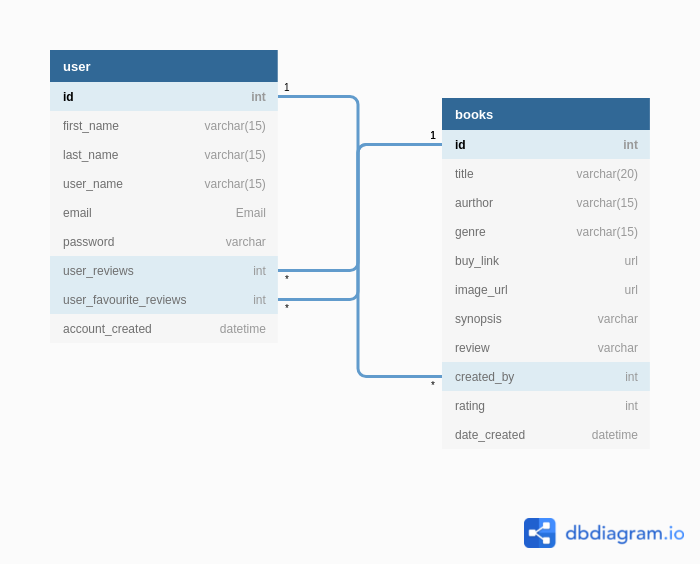

# Milestone Project 3

## User Experience (UX)

## User Stories

## Technologies

The Technologies used in this project are listed bellow.

- [DBdiagram](https://dbdiagram.io/)
- [Materialize](https://materializecss.com/)
- [HTML5](https://en.wikipedia.org/wiki/HTML5/)
- [CSS3](https://en.wikipedia.org/wiki/CSS/)
- [MongoDB](https://www.mongodb.com/)
- [Heroku](https://www.heroku.com/)
- [GitHub](https://github.com/Darian-Frey/)
- [Gitpod](https://www.gitpod.io/)
- [jQuery](https://jquery.com/)

## Design

## Wireframe

Wireframes created with [WireframeSketcher](https://wireframesketcher.com)

## Database Models and Schema

[dbdiagram](https://dbdiagram.io/)

```
Table user {
  id int [pk, not null, unique]
  first_name varchar(15) [not null]
  last_name varchar(15) [not null]
  user_name varchar(15) [not null, unique]
  email Email [not null, unique]
  password varchar // type:hash
  user_reviews int [ref: > books.id]
  user_favourite_reviews int [ref: > books.id]
  account_created datetime
}


Table books {
  id int [pk, unique]
  title varchar(20)
  aurthor varchar(15)
  genre varchar(15)
  buy_link url
  image_url url
  synopsis varchar
  review varchar
  created_by int [ref: > user.id]
  rating int
  date_created datetime
}
```



## Media

## Features

## Testing

## Deployment

## Credits & Acknowledgements