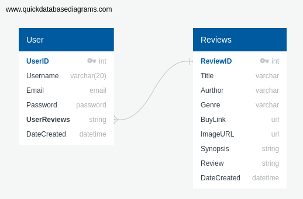

# Milestone Project 3

## [**Table of Contents**](#table-of-contents)

- [UX](#UX)
- [User Stories](#User-Stories)
- [Technologies](#Technologies)
- [Wireframe](#Wireframe)
- [Database Models and Schema](#Database-Models-and-Schema)
- [Media](#Media)
- [Features](#Features)
- [Testing](#Testing)
- [Deployment](#Deployment)
- [Credits & Acknowledgements](#Credits-&-Acknowledgements)

## **UX**

## **User Stories**

- *"As a user, I want to immediately understand the purpose of the site"*
- *"As a user, I want to create my own reviews."* 
- *"As a user, I want to easily access my own content."* 
- *"As a user, I want to edit reviews I have created."*
- *"As a user, I want to control my own content."*  
- *"As a user, I want to be able to delete reviews I have created."*  
- *"As a user, I want to be able to delete my account."*  
- *"As a user, I want to be able to browse reviews created by other users."*
- *"As a user, I want to be directed to a site where I can buy a book."*
- *"As a user, I want a site that is visually appealing."*  
- *"As a user, I want a site that is easy to navigate."* 
- *"As a user, I want a site that is intuitive."*  

##### [Back to Table of Contents](#table-of-contents)

## **Technologies**
##### [Back to Table of Contents](#table-of-contents)

The Technologies used in this project are listed bellow.

### **Languages**
- **HTML** - used to create the structure of the application
- **CSS** - used to position and style the application 
- **JavaScript** - used to for interactivity
- **Python** - used to handle backend
- **Jinja** - Python templating language

### **Libraries and Frameworks**
- [Flask](https://flask.palletsprojects.com/en/1.1.x/)
- [Werkzeug](https://werkzeug.palletsprojects.com/en/1.0.x/)
- [Materialize CSS](https://materializecss.com/) 
- [Google Fonts](https://fonts.google.com/) 
- [Font Awesome](https://fontawesome.com/) 
- [jQuery](https://code.jquery.com/) 

### **Project Management**
- [Git](https://git-scm.com/) 
- [Gitpod](https://gitpod.io/) 
- [Github](https://github.com/) 
- [Heroku](https://signup.heroku.com)
- [MongoDB](https://www.mongodb.com/)

### **Tools**
- [Chrome DevTools](https://developers.google.com/web/tools/chrome-devtools) 
- [WireFrameSketcher](https://wireframesketcher.com/)
- [Am I Responsive](http://ami.responsivedesign.is/)
- [Favicon](https://favicon.io/favicon-converter/) 
- [Coolors](https://coolors.co/)


## **Wireframe**

The wireframes for this project do not represent the final project.
To view the wireframes click [here](https://github.com/Darian-Frey/Milestone-Project-Three/tree/master/Wireframes/pdf) for PDF and [here](Wireframes/images/wireframepng.md) for PNG files.

##### [Back to Table of Contents](#table-of-contents)

Wireframes created with [WireframeSketcher](https://wireframesketcher.com)

## **Database Models and Schema**
##### [Back to Table of Contents](#table-of-contents)

[QuickDBD](https://app.quickdatabasediagrams.com//)

```
User
-
UserID PK int
Username varchar(20)
Email email
Password password
UserReviews string FK >- Reviews.ReviewID
DateCreated datetime


Reviews
-
ReviewID PK int
Title varchar
Aurthor varchar
Genre varchar
BuyLink url
ImageURL url
Synopsis string
Review string
DateCreated datetime
```



## **Media**

The main background image is by Alfons Morales on [Unsplash](https://unsplash.com/).

##### [Back to Table of Contents](#table-of-contents)

## **Features**

The main features of the Reader's corner are,

- A responsive design.
- Responsive navigation bar.
- Users can register an account.
- Users can add their own reviews.
- A user can read everyone's reviews.
- The user profile will show only the session users reviews.
- Users can edit their reviews.
- Users can delete their reviews.
- Users can delete their account.
- A buy me link will take the user to the books amazon page.
- A footer with social media links.
- A link to my Github in the footer.

## **Future Features**

- A review rating system. A user can give a 1 to 5 star rating to other people's reviews.
- A search function. The ability to search the reviews based on genre, user name, user rating, author or book title.
- Lost password recovery feature.


##### [Back to Table of Contents](#table-of-contents)

## **Testing**
##### [Back to Table of Contents](#table-of-contents)

## **Deployment**

The live project can be viewed [here](https://book-review-shane.herokuapp.com/).

### Commiting to Github
1. Using my terminal window I firstly use `git pull https://github.com/Darian-Frey/Milestone-Project-Three.git` to pull the most upto date version of my repository.
2. Once upto date I edit everything I need to and use `git add .` to stage all the edited files for commiting.

3. Using `git status` I usually view to see I have staged all the files I want to and I have no unwanted files being commited.
4. Next using `git commit` I commit to the local Repository and then `git push` to finally push the changes to the master branch.

### Deploying to Heroku
1. Firstly I needed to go to my Account dashboard, here I can select New and Create New App.
2. I chose a unique app name, the region of Europe and then pressed create app.
3. Once Created I was brought to the deploy section of my app, here I decided to chose to deploy with Github.
4. Heroku then asked for the repo name of my app I wished to deploy.
5. I selected connect once my repo was found and I was then able to commit to the master branch on Github. 
It will then Deploy Automatically as I have automatic deploys turned on.
6. The site is almost deployed but I then needed to go to the settings section and let Heroku know of any enviroment variables such as the ip, Port, Secret key and database URI.

### Cloning the repository
To run this repository locally:
1. Click "Code" at the top of this repository.
2. Select Download Zip or Copy the URL to your clipboard. 
3. Open up Terminal and select the location in which you wish to clone this directory.
4. Then type `git clone` and copy `https://github.com/Darian-Frey/Milestone-Project-Three.git` 
5. Press enter and you will have succesfully cloned this Repository. 

### Installing dependencies
Installing Dependencies is very simple and I have supplied a requirements.txt to help with this process. Once the repository has been cloned before it can be ran the user will need to open the terminal on their IDE and type `pip3 install -r requirements.txt`. All the dependencies should now download and you are ready to go.


##### [Back to Table of Contents](#table-of-contents)

## **Credits & Acknowledgements**
##### [Back to Table of Contents](#table-of-contents)
